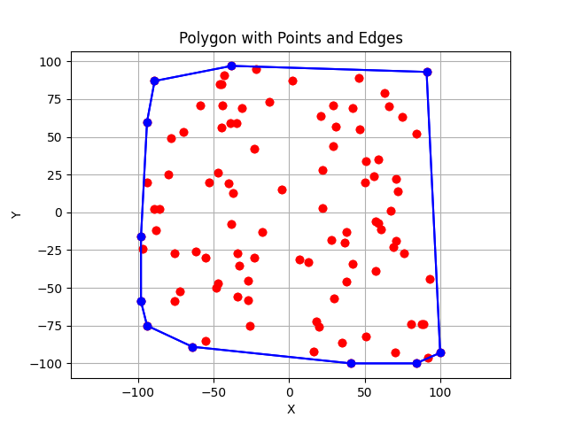
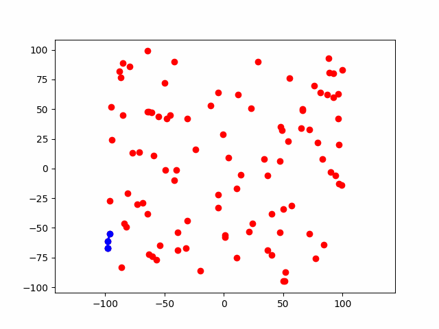
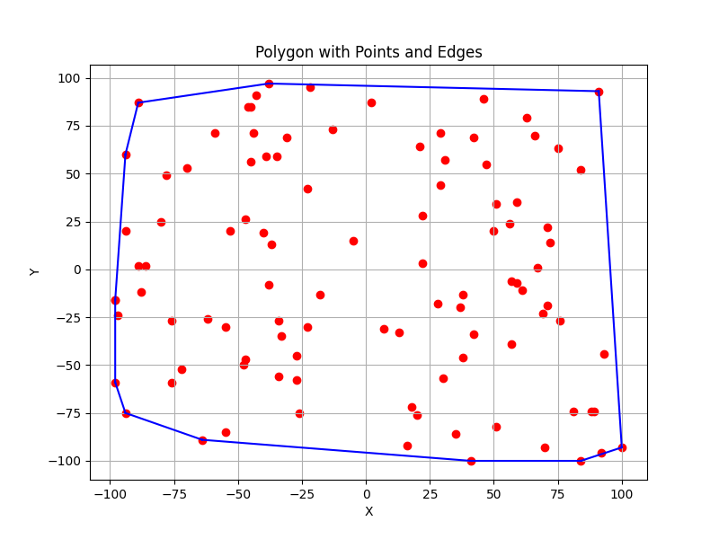

# Εργασία Υπολογιστικής Γεωμετρίας
## Όνομα: Μιχάλης Δεικτάκης
## ΑΜ: 1115200800018

## Υλοποίηση Α. Υλοποιήσεις αλγορίθμων Κυρτού περιβλήματος:
Έχουν υλοποιηθεί οι αλγόριθμοι Incremental, Gift Wrapping, QuickHull, και QuickHull3D για την εκτέλεση του προγράμματος θα χρειαστεί:
- `pip install -r requirements.txt`
- `python3 main.py -a [algorithm] -n [number_of_points] -v` (optional για εμφάνιση plot)

Οι επιλογές για το `[algorithm]` είναι οι:
- "incremental"
- "giftwrap"
- "quickhull"
- "quickhull3D"
- "kdtree"
- "all" (τρέχει όλους τους αλγόριθμους και εκτυπώνει τους χρόνους εκτέλεσης, δεν χρησιμοποιείται το -v με αυτή την επιλογή)

## Εφαρμογή Α. Εφαρμογή αλγορίθμων:
1) Σημεία στο επίπεδο
  Τα αρχικά 100 σημεία που χρησιμοποιήθηκαν σε αυτή την εκτέλεση του προγράμματος είναι τα :
     
     [(-46,85), (38,-46), (47,55), (67,1), (42,-34), (76,-27), (41,-100), (46,89), (-31,69), (-98,-59), (-47,-47), (-55,-85), (92,-96), (-45,56), (-72,-52), (63,79), (-62,-26), (30,-57), (13,-33), (88,-74), (-34,-27), (51,34), (75,63), (-78,49), (50,20), (100,-93), (59,-7), (21,64), (81,-74), (56,24), (-94,60), (57,-6), (-70,53), (22,3), (89,-74), (69,-23), (-94,-75), (16,-92), (-22,95), (29,71), (42,69), (-39,59), (59,35), (71,22), (-53,20), (84,-100), (-47,26), (-18,-13), (-88,-12), (-80,25), (22,28), (71,-19), (-27,-45), (66,70), (29,44), (-64,-89), (-26,-75), (51,-82), (2,87), (72,14), (57,-39), (-89,2), (38,-13), (-97,-24), (61,-11), (93,-44), (37,-20), (-89,87), (-38,-8), (35,-86), (31,57), (-45,85), (18,-72), (-37,13), (-44,71), (-35,59), (-98,-16), (-38,97), (-13,73), (-94,20), (-55,-30), (-5,15), (-40,19), (-34,-56), (-33,-35), (84,52), (-43,91), (91,93), (-76,-27), (-76,-59), (-27,-58), (-23,42),(-59,71), (70,-93), (20,-76), (-23,-30), (7,-31), (-48,-50), (-86,2), (28,-18)]
   
   - `Incremental`  
     
     Οι κορυφές του Κυρτού περιβλήματος είναι οι:
     
     [(-98, -59), (-94, -75), (-64, -89), (41, -100), (84, -100), (100, -93), (91, 93), (-38, 97), (-89, 87), (-94, 60), (-98, -16)]

   Οπτικοποίηση Σημείων:
   
   

   Οπτικοποίηση Κατασκευής για το (γ):
   
   
   
  - `Gift Wrapping`
    
    Οι κορυφές του Κυρτού περιβλήματος είναι οι:

    [(-98, -59), (-94, -75), (-64, -89), (41, -100), (84, -100), (100, -93), (91, 93), (-38, 97), (-89, 87), (-94, 60), (-98, -16)]

     Οπτικοποίηση Σημείων:
   
   
