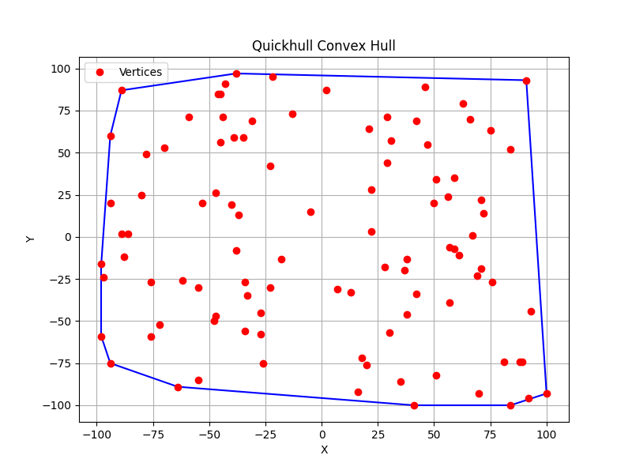
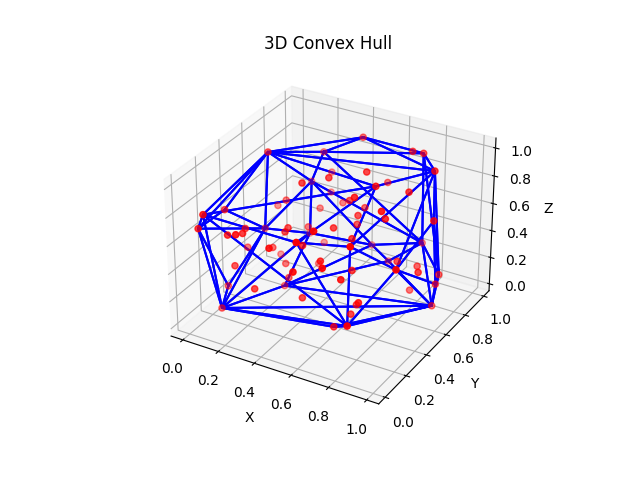

# Εργασία Υπολογιστικής Γεωμετρίας
## Όνομα: Μιχάλης Δεικτάκης
## ΑΜ: 1115200800018

## Υλοποίηση Α. Υλοποιήσεις αλγορίθμων Κυρτού περιβλήματος:
Έχουν υλοποιηθεί οι αλγόριθμοι Incremental, Gift Wrapping, QuickHull, και QuickHull3D για την εκτέλεση του προγράμματος θα χρειαστεί:
- `pip install -r requirements.txt`
- `python3 main.py -a [algorithm] -n [number_of_points] -v` (optional για εμφάνιση plot)

Οι επιλογές για το `[algorithm]` είναι οι:
- "incremental"
- "giftwrap"
- "quickhull"
- "quickhull3D"
- "kdtree"
- "all" (τρέχει όλους τους αλγόριθμους και εκτυπώνει τους χρόνους εκτέλεσης, δεν χρησιμοποιείται το -v με αυτή την επιλογή)

## Εφαρμογή Α. Εφαρμογή αλγορίθμων:
1) Σημεία στο επίπεδο
  Τα αρχικά 100 σημεία που χρησιμοποιήθηκαν σε αυτή την εκτέλεση του προγράμματος είναι τα :
     
     [(-46,85), (38,-46), (47,55), (67,1), (42,-34), (76,-27), (41,-100), (46,89), (-31,69), (-98,-59), (-47,-47), (-55,-85), (92,-96), (-45,56), (-72,-52), (63,79), (-62,-26), (30,-57), (13,-33), (88,-74), (-34,-27), (51,34), (75,63), (-78,49), (50,20), (100,-93), (59,-7), (21,64), (81,-74), (56,24), (-94,60), (57,-6), (-70,53), (22,3), (89,-74), (69,-23), (-94,-75), (16,-92), (-22,95), (29,71), (42,69), (-39,59), (59,35), (71,22), (-53,20), (84,-100), (-47,26), (-18,-13), (-88,-12), (-80,25), (22,28), (71,-19), (-27,-45), (66,70), (29,44), (-64,-89), (-26,-75), (51,-82), (2,87), (72,14), (57,-39), (-89,2), (38,-13), (-97,-24), (61,-11), (93,-44), (37,-20), (-89,87), (-38,-8), (35,-86), (31,57), (-45,85), (18,-72), (-37,13), (-44,71), (-35,59), (-98,-16), (-38,97), (-13,73), (-94,20), (-55,-30), (-5,15), (-40,19), (-34,-56), (-33,-35), (84,52), (-43,91), (91,93), (-76,-27), (-76,-59), (-27,-58), (-23,42),(-59,71), (70,-93), (20,-76), (-23,-30), (7,-31), (-48,-50), (-86,2), (28,-18)]
   
   - `Incremental`  
     
     Οι κορυφές του Κυρτού περιβλήματος είναι οι:
     
     [(-98, -59), (-94, -75), (-64, -89), (41, -100), (84, -100), (100, -93), (91, 93), (-38, 97), (-89, 87), (-94, 60), (-98, -16)]

   Οπτικοποίηση Σημείων:
   
   

   Οπτικοποίηση Κατασκευής για το (γ):

    (αφορά άλλη εκτέλεση του αλγορίθμου)
   
   
   
  - `Gift Wrapping`
    
    Οι κορυφές του Κυρτού περιβλήματος είναι οι:

    [(-98, -59), (-94, -75), (-64, -89), (41, -100), (84, -100), (100, -93), (91, 93), (-38, 97), (-89, 87), (-94, 60), (-98, -16)]

     Οπτικοποίηση Σημείων:
   
     

  - `QuickHull`
    
    Οι κορυφές του Κυρτού περιβλήματος είναι οι:

    [(100, -93), (91, 93), (-38, 97), (-89, 87), (-94, 60), (-98, -16), (-98, -59), (-94, -75), (-64, -89), (41, -100), (84, -100)]

     Οπτικοποίηση Σημείων:
   
    

 - `Σύγκριση Αλγορίθμων ώς προς τον χρόνο`

Όπως βλέπουμε στον παρακάτω πίνακα όταν ο αριθμός των σημείων είναι μικρός, ο αλγόριθμος gift wrap έχει πολύ καλούς χρόνους,
το ίδιο θα βλέπαμε και από τον incremental αλλά η υλοποίηση μου δεν είναι η καλύτερη δυνατή, λόγω κάποιων ελέγχων για την διόρθωση φοράς.
Όταν τα σημεία πληθαίνουν βλέπουμε ότι ο QH έχει πολύ καλύτερο χρόνο από τους άλλους 2 μιας και "ξεσκαρτάρει" πολλά σημεία στο πρώτο βήμα.
Ειδικά αφού στις δοκιμές επειδή το range των σημείων είναι από (-100,-100) σε (100, 100) όταν το πλήθος είναι μεγάλο υπάρχει μεγάλη πυκνότητα στο κέντρο.

|           | Incremental | Gift Wrap  | Quick Hull |
|-----------|------------|------------|------------|
| 100       | 0.00833    | 0.00031    | 0.00066    |
| 200       | 0.05300    | 0.00095    | 0.00023    |
| 500       | 0.14967    | 0.00280    | 0.00034    |
| 1000      | 0.26051    | 0.00736    | 0.00041    |
| 2000      | 0.48197    | 0.01829    | 0.00045    |
| 5000      | 0.64095    | 0.08419    | 0.00071    |
| 10000     | 0.92916    | 0.22580    | 0.00112    |  

2) Σημεία στις 3 διαστάσεις:

- `QuickHull 3D`

Σημεία του Κυρτού περιβλήματος  
[0.43758721 0.891773   0.96366276]
[0.56804456 0.92559664 0.07103606]
[0.0871293  0.0202184  0.83261985]
[0.77815675 0.87001215 0.97861834]
[0.67063787 0.21038256 0.1289263 ]
[0.43860151 0.98837384 0.10204481]
[0.82099323 0.09710128 0.83794491]
[0.09609841 0.97645947 0.4686512 ]
[0.97676109 0.60484552 0.73926358]
[0.03918779 0.28280696 0.12019656]
[0.09394051 0.5759465  0.9292962 ]
[0.58651293 0.02010755 0.82894003]
[0.00469548 0.67781654 0.27000797]
[0.73519402 0.96218855 0.24875314]
[0.72525428 0.50132438 0.95608363]
[0.0191932  0.30157482 0.66017354]
[0.91948261 0.7142413  0.99884701]
[0.1494483  0.86812606 0.16249293]
[0.85580334 0.01171408 0.35997806]
[0.05433799 0.19999652 0.01852179]
[0.92808129 0.7044144  0.03183893]
[0.18619301 0.94437239 0.7395508 ]
[0.02467873 0.06724963 0.67939277]
[0.99033895 0.21689698 0.6630782 ]
[0.95279166 0.68748828 0.21550768]
[0.94737059 0.73085581 0.25394164]
[0.21331198 0.51820071 0.02566272]  

Οπτικοποίηση Σημείων:  

  

## Εφαρμογή B. Εφαρμογή KD Tree:  

Αρχικά Σημεία:  
[(-86,21), (23,-36), (-42,18), (-11,-47), (52,-34), (-64,-77), (17,18), (9,-63), (-40,-11), (50,-31), (-8,43), (3,19), (-91,42), (-37,-37), (87,-95), (39,56), (-37,44), (20,21), (-8,-60), (-47,-62), (43,-32), (28,-34), (-32,53), (90,-14), (1,-38), (-18,98), (-47,-63), (-36,-41), (74,26), (-21,30), (-26,72), (-24,26), (-25,96), (2,0), (-5,-58), (-35,-14), (-53,-86), (13,-47), (83,14), (100,96), (-86,56), (9,-15), (-66,6), (-96,-99), (-28,-35), (-65,31), (-38,-52), (-94,52), (-98,-38), (-25,6), (-88,-75), (-98,-90), (30,-49), (77,-40), (-91,-80), (17,29), (-45,45), (48,58), (-45,19), (25,48), (-80,-29), (51,-29), (71,-54), (7,-60), (70,46), (44,-97), (-51,74), (-37,-19), (83,46), (-72,-75)]  

Ορθογώνιο:  
[(-50, -20), (-50, 25), (75, 25), (75, -20)]  

Σημεία μέσα στο ορθογώνιο:  
[(-18, -1), (-18, -9), (48, 15), (70, -16), (31, -2), (17, -15), (63, 14), (74, -12), (30, 21), (2, 19), (40, 21), (63, 23)]  

Οπτικοποίηση KD Tree:  
  

